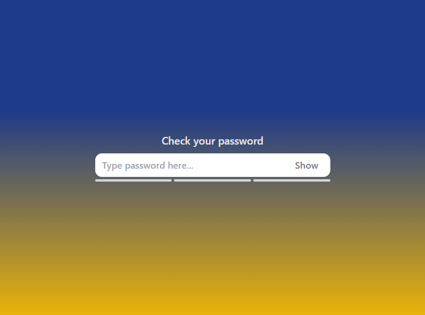
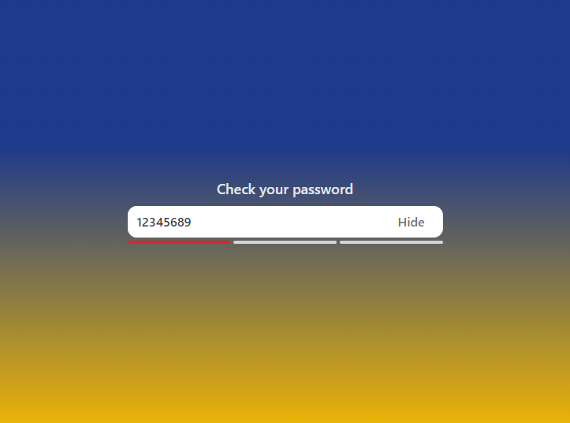
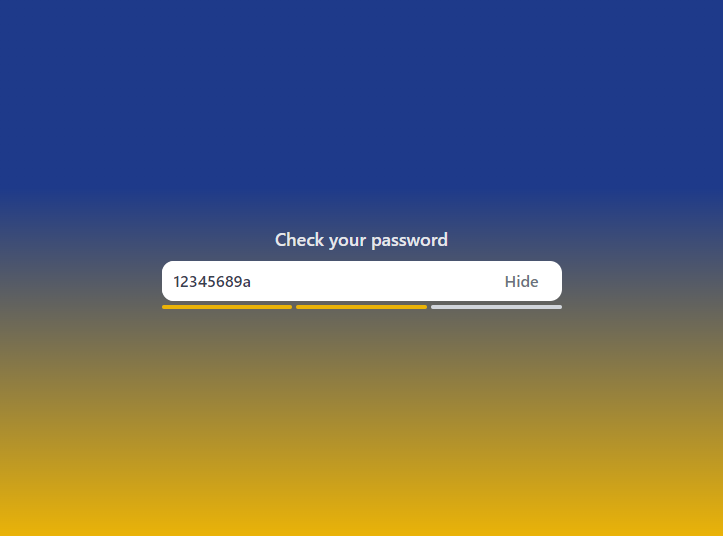
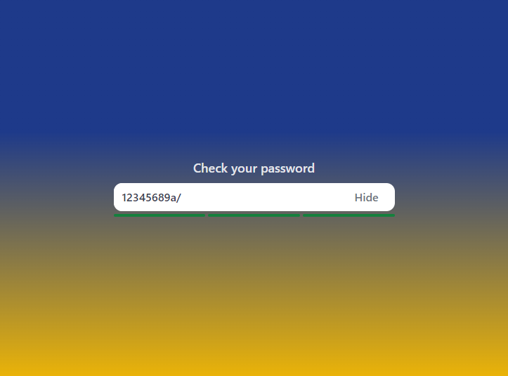

# Password Validator

  
  
  
  

Deployed on [Vercel](https://password-validator-h0wter.vercel.app/) 

This project was generated with [Angular CLI](https://github.com/angular/angular-cli) version 16.1.0.

## Application Description:
The application allows you to check the strength of the password. Depending on the complexity of the password, the indicators below the field change color. Here are the password rules:
#### Mode with 3 indicators:
1. If the field is empty, all sections are gray;
2. If the field has less than 8 characters, all sections are red;
3. If the password consists only one of letters/digits/symbols - the first section is red the rest are gray;
4. If the password consists two different types of characters of letters/digits/symbols - the first two sections are yellow the last one is gray;
5. If the password consists all types of characters of letters/digits/symbols, all sections are green;
#### Mode with 5 indicators:
1. If the field is empty, all sections are gray;
2. If the field has only one of letters/digits/symbols:
   - If the field has less than 6 characters - all sections are red;
   - If the field has less than 8 characters - the first three sections are red, the two last are gray;
   - If the field has less than 10 characters - the first four sections are red, the last one is gray;
   - If the field has 10 or more characters - the first two sections are yellow, the three last are gray;
3. If the field has two different types of characters of letters/digits/symbols:
   - If the field has less than 6 characters - the first three sections are red, the two last are gray;
   - If the field has less than 8 characters - the first one section is red, the five last are gray;
   - If the field has less than 10 characters - the first two sections are yellow, the three last are gray;
   - If the field has less than 12 characters - the first three sections are green, the two last are gray;
   - If the field has 12 or more characters - all sections are green;
4. If the field has two different types of characters of letters/digits/symbols:
   - If the field has less than 6 characters - the first one section is red, the five last are gray;
   - If the field has less than 8 characters - the first two sections are yellow, the three last are gray;
   - If the field has less than 10 characters - the first three sections are green, the two last are gray;
   - If the field has less than 12 characters - all sections are green;
   - If the field has 12 or more characters - all sections are blue;

## Examples

## Development server

Run `ng serve` for a dev server. Navigate to `http://localhost:4200/`. The application will automatically reload if you change any of the source files.

## Build

Run `ng build` to build the project. The build artifacts will be stored in the `dist/` directory.

## Running unit tests

Run `ng test` to execute the unit tests via [Karma](https://karma-runner.github.io).
